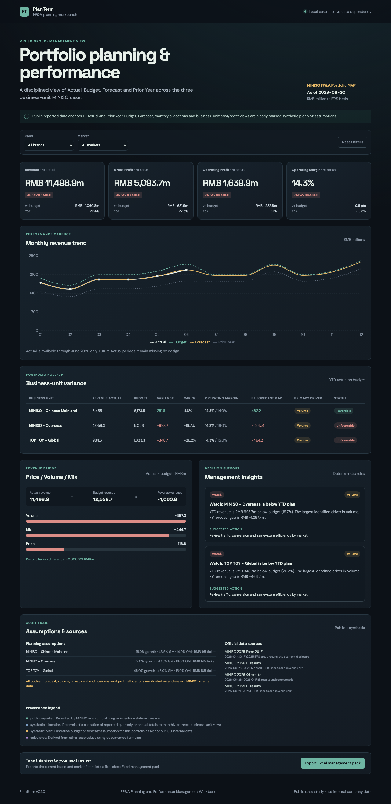

# PlanTerm

PlanTerm is an FP&A planning and performance management workbench. The v0.1 portfolio MVP uses MINISO Group as a public-data case and presents Actual, Budget, Forecast and Prior Year across:

- MINISO — Chinese Mainland
- MINISO — Overseas
- TOP TOY — Global

The dashboard is an English, local-first application with a deterministic API and an Excel management pack. It covers revenue, gross profit, operating profit, margin, variance analysis and a Price / Volume / Mix bridge. Public reported figures are separated from synthetic allocations and illustrative planning assumptions throughout the product.



## Quick start

Requirements: Python 3.12+ and Node.js 24+.

```bash
./scripts/rebuild_workspace.sh
./run_app.sh
```

Open [http://127.0.0.1:8000](http://127.0.0.1:8000). The application reads the committed case files and does not need a database, user account or live data connection to display the case.

## API

| Method | Endpoint | Purpose |
|---|---|---|
| GET | `/health` | Service health and version |
| GET | `/api/v1/cases` | Available planning cases |
| GET | `/api/v1/cases/{case_id}/dashboard` | Dashboard aggregation with `brand` and `market` filters |

The API uses a consistent error shape: `error`, `error_type` and `details`. Unknown cases return 404, invalid filters return 422, and internal errors do not expose stack traces.

## Data and provenance

The committed public snapshot is anchored to MINISO's 2025 Form 20-F and official 2025 H1, 2026 Q1 and 2026 H1 investor-relations releases. The case uses RMB millions and IFRS-reported group metrics. Monthly values, three-business-unit allocations, budget, forecast, volume, ticket and profit allocations are deterministic and explicitly marked as synthetic or calculated.

`scripts/refresh_public_actuals.py` is a dry-run-first refresh utility. It downloads the fixed official source, validates the expected HTML table fields and fails loudly when the page structure changes. Pass `--write` only after reviewing the displayed differences.

`scripts/build_miniso_case.py --check` verifies that the committed `planning_records.csv` is exactly reproducible from the snapshot and assumptions.

## Excel management pack

The dashboard export produces `PlanTerm_MINISO_2026H1_Management_Pack.xlsx` with:

1. Executive Summary
2. Monthly Trend
3. Business Unit Variance
4. PVM Bridge
5. Assumptions & Sources

The export follows the active dashboard filters and uses RMB millions as the default unit.

## Validation

```bash
python -m pip check
python -m pytest -q
python scripts/build_miniso_case.py --check
cd web
npm run lint
npm run build
npm run e2e:preflight
```

## Project history and license

PlanTerm is an independent repository. Its FastAPI error handling, configuration patterns and selected React UI primitives were adapted from the author's earlier RiskLens project; no RiskLens Git history is copied into this repository. PlanTerm is released under the [MIT License](./LICENSE).

